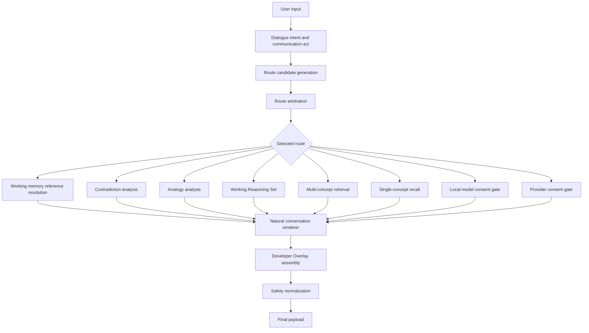
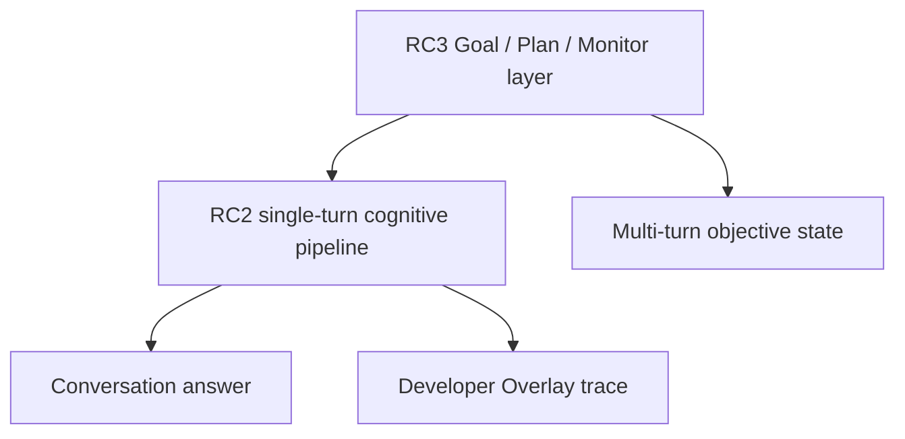

# RC2 Cognitive Pipeline Specification

RC2 is the conversational foundation for DELTA as a Developmental Cognitive Model runtime. Its job is to answer one user turn coherently while preserving governed cognition underneath. RC2 does not introduce goals, introspection, autonomous planning, persistent episodic cognition, training, provider autonomy, canonical writes, or self-directed actions.

This document is the freeze contract for RC2. Future RC3 work should attach above or beside this pipeline without weakening these boundaries.

## Pipeline Overview

## Stage Contracts

### 1. User Input

Input is a single conversational turn plus optional short-term history. RC2 treats each turn as read-only unless the user explicitly enters an approval workflow.

Rules:

- Do not infer provider approval from ordinary conversation.
- Do not infer memory approval from praise, thanks, or generic affirmation.
- Do not persist short-term conversation state unless the operator explicitly approves a memory workflow.
- Do not treat accidental punctuation or slashes as semantic topic changes.

### 2. Dialogue Intent And Communication Act

The dialogue-act layer classifies what kind of communication the user is performing before retrieval or model routing.

Examples:

- greeting
- thanks
- compliment
- acknowledgement
- refusal/cancel
- factual question
- conceptual question
- contradiction check
- analogy request
- follow-up
- memory command
- diagnostics command

Contract:

- Social-only turns must not trigger retrieval, local model calls, provider offers, or memory candidates.
- Yes/no must bind only to a live pending action.
- Follow-ups must preserve recent context but yield to higher-priority contradiction or analogy routes when explicit.

### 3. Route Candidate Generation

The runtime builds an inspectable list of plausible route families. Candidate generation is diagnostic and read-only; it does not mutate state or dispatch actions.

Candidate route families:

- safety
- explicit user command
- social conversation
- contradiction analysis
- analogy analysis
- working-memory reference resolution
- Working Reasoning Set
- multi-concept retrieval
- single-concept recall
- local-model consent
- provider consent

Contract:

- Candidate generation must be conservative.
- A route may appear as a candidate without being selected.
- Candidate traces belong in Developer Overlay, not normal chat.

### 4. Route Arbitration

Arbitration decides which cognitive route should answer the turn. RC2 currently records arbitration as an auditable trace while dispatch remains implemented through ordered runtime checks. The trace must make route conflicts visible and testable.

Precedence summary:

1. Safety and hard invariants
2. Explicit user command or explicit mode
3. Social conversation
4. Contradiction analysis
5. Working-memory reference resolution for context-dependent references
6. Analogy analysis
7. Working Reasoning Set
8. Multi-concept retrieval
9. Single-concept recall
10. Local-model consent
11. Provider consent

Important nuance:

- Contradiction remains above working memory because a pronoun can refer to contradictory prior claims.
- Working memory runs before analogy/WRS when a turn is truly reference-dependent, such as "Where does that analogy break?"
- Analogy remains above WRS when the user asks for source/target mapping or limits of analogy.
- WRS remains above recall when the user asks for a shared pattern, bridge, missing evidence, or multi-concept relationship.
- Recall remains above local-model consent when the cleaned query matches approved substrate knowledge.

Contract:

- The selected route and the recommended arbitration group must be recorded.
- Misalignment between dispatch and arbitration is a bug unless explicitly documented.
- Route candidates and rejected routes must be visible in Developer Overlay.

### 5. Working Memory Reference Resolution

Working memory is an ephemeral context resolver, not a general answer engine. It resolves short-horizon references such as:

- that
- this
- it
- the first one
- go back to planning
- tell me more
- where does that break

Contract:

- State is ephemeral and bounded to recent turns.
- It must not create persistent episodic memory.
- It must not override explicit topic changes.
- It must yield when the resolved intent is contradiction, analogy, WRS, or direct recall.

### 6. Specialized Cognitive Routes

#### Contradiction Analysis

Purpose:

- Compare claims, polarity, qualifiers, definitions, timeframe, scope, and population.

Output:

- compatibility or contradiction classification
- claims compared
- reason for conflict or compatibility
- uncertainty or missing evidence

No writes, no training, no provider calls.

#### Analogy Analysis

Purpose:

- Map source and target structures.
- Explain what works and where the analogy breaks.

Output:

- source/target roles
- shared structure
- limits of analogy
- unsupported mappings

No writes, no training, no provider calls.

#### Working Reasoning Set

Purpose:

- Hold multiple retrieved concepts and propositions together for grounded comparison.
- Build a cautious organizing principle before supporting facts.

Output order:

1. Higher-order bridge or organizing principle.
2. Supporting stored propositions.
3. Uncertainty and missing evidence.
4. Optional graph/evidence context in Developer Overlay.

No synthesis activation by default. No memory write.

#### Multi-Concept Retrieval

Purpose:

- Return a reviewed retrieval set when the user asks for multiple concepts but not reasoning.

Output:

- 2-5 relevant concepts
- retrieval quality
- duplicate suppression information in overlay

No synthesis and no writes.

#### Single-Concept Recall

Purpose:

- Answer direct factual/conceptual questions from approved local substrate.

Recall query cleanup:

- "What are the key points about photosynthesis?" searches for "photosynthesis."
- "Explain inflation in one useful paragraph from local memory" searches for "inflation."
- "What is X? Use your local substrate if available" searches for "X."

No local model consent should appear when substrate recall is sufficient.

### 7. Consent Gates

#### Local-Model Consent

Local models may execute only when the caller explicitly requests local inference or the user approves a pending local-model offer.

Default behavior:

- offer, do not execute
- compact prompt packet
- include short relevant history
- no raw logs or irrelevant diagnostics

#### Provider Consent

Provider/API support is never automatic.

Default behavior:

- ask first
- send compact support packet only after approval
- no full JSONL stores, raw hashes, or unrelated history

### 8. Natural Renderer

The renderer turns structured cognitive output into ordinary conversation.

Contract:

- Default chat should not expose route names, hashes, raw JSON, safety boilerplate, or report headings.
- Developer Overlay keeps utility details available.
- The answer should lead with the useful human explanation.
- Uncertainty should be natural and brief.
- Internal wording belongs behind the overlay.

### 9. Developer Overlay Assembly

The overlay is the cockpit, not the default product.

It may show:

- communication act
- intent
- candidate routes
- selected route
- rejected routes
- arbitration recommendation
- CognitiveEpisode state
- WRS details
- contradiction/analogy traces
- retrieval scores
- natural renderer transformations
- safety metadata completeness

Normal chat must remain conversational-first.

### 10. Safety Normalization

Every final payload must explicitly include safety flags:

- `provider_calls_performed`
- `web_search_performed`
- `training_performed`
- `fine_tuning_performed`
- `weight_update_performed`
- `canonical_write_performed`
- `noncanonical_write_performed`
- `graph_write_performed`
- `replay_write_performed`
- `autonomous_action_performed`
- `scheduler_action_performed`
- `hyb1_promoted`
- `model_b_replaced`

Missing metadata is a diagnostic defect even when behavior is safe. The shared finalizer fills safe defaults and reports missing fields in Developer Overlay.

## RC2 Freeze Criteria

RC2 is freeze-ready when:

- working memory is calibrated
- route arbitration is stable and inspectable
- recall routing uses approved substrate before model consent
- WRS can express organizing principles before facts
- adversarial routing benchmark passes
- safety metadata is normalized
- normal output has no internal leaks, report voice, or scaffold exposure
- benchmark reports are repeatable
- no training, provider autonomy, canonical writes, autonomous actions, scheduler activation, HYB1 promotion, or Model B replacement occurs

Current freeze status:

- `reports/RC2_FREEZE_READINESS_REVIEW.json`: `READY_FOR_RC2_REFINEMENT_FREEZE`
- `reports/RC2_ORCHESTRATION_STABILIZATION.json`: `PROCEED_RC2_COGNITIVE_REFINEMENT_FREEZE`

## RC3 Attachment Points

The following capabilities belong in RC3 and should attach above RC2 rather than rewriting RC2 internals:

- goal framework
- introspection
- long-term planning
- self-evaluation
- meta-reasoning
- persistent episodic cognition
- curriculum/graduation workflows

Suggested RC3 relationship:

RC3 may call the RC2 pipeline repeatedly, but RC2 should remain stable as the answer-this-turn contract.

## Non-Negotiable Invariants

- No training by default.
- No fine-tuning by default.
- No weight updates by default.
- No provider/API call without explicit approval.
- No canonical writes.
- No autonomous noncanonical memory writes.
- No graph mutation outside operator-approved graph workflows.
- No replay writes outside explicit governed workflows.
- No autonomous action execution.
- No scheduler activation.
- HYB1 remains dormant unless separately promoted under governance.
- Model B remains unchanged unless separately approved under a future protocol.
- Conversation remains the primary product; governed cognition remains the engine beneath it.
