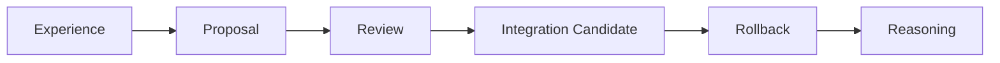

# DELTA ARC I Unified Audit Graph

```mermaid
flowchart LR
  A["Experience"] --> B["Proposal"]
  B --> C["Review"]
  C --> D["Integration Candidate"]
  D --> E["Rollback"]
  E --> F["Reasoning"]
```

The audit graph links cognitive artifacts for inspection. It is graph-only and
does not replace stores or perform integration.

