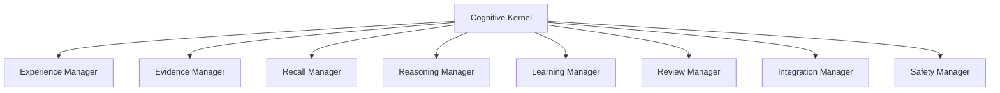

# DELTA ARC I Kernel Architecture

Runtime ARC I introduces an orchestration-only Cognitive Kernel.

The kernel coordinates existing runtime surfaces. It does not train, call
providers, mutate memory, execute actions, promote HYB1, or start schedulers.

