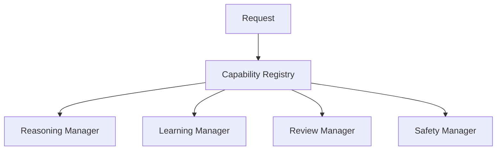

# DELTA ARC I Kernel Registry

The Cognitive Capability Registry lets the kernel ask which manager handles a
capability instead of hardcoding direct calls.

Dangerous capabilities such as provider calls, training, action execution, and
scheduler activation remain inactive.

