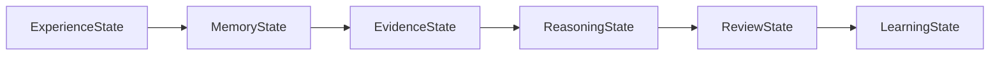

# DELTA ARC I Runtime State Diagram

```mermaid
flowchart LR
  A["ExperienceState"] --> B["MemoryState"]
  B --> C["EvidenceState"]
  C --> D["ReasoningState"]
  D --> E["ReviewState"]
  E --> F["LearningState"]
```

RuntimeState is a snapshot, not a store. It reports current state without
mutating memory, recall, providers, schedulers, or actions.

