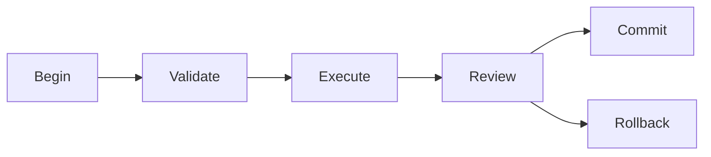

# DELTA ARC I Transaction Lifecycle

```mermaid
flowchart LR
  A["Begin"] --> B["Validate"]
  B --> C["Execute"]
  C --> D["Review"]
  D --> E["Commit"]
  D --> F["Rollback"]
```

ARC I models the lifecycle only. No operation receives permission to mutate
outside a transaction, and ARC I transactions still perform no live writes.

