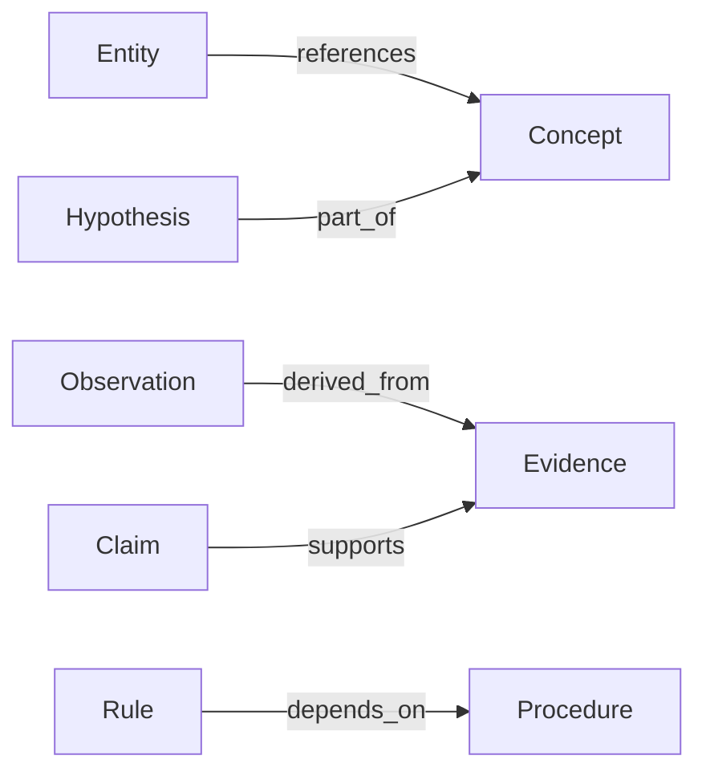

# DELTA ARC II Knowledge Graph Diagram

```mermaid
flowchart LR
  A["Entity"] -->|references| B["Concept"]
  C["Observation"] -->|derived_from| D["Evidence"]
  E["Claim"] -->|supports| D
  F["Rule"] -->|depends_on| G["Procedure"]
  H["Hypothesis"] -->|part_of| B
```

The graph is deterministic and report-only in ARC II.

