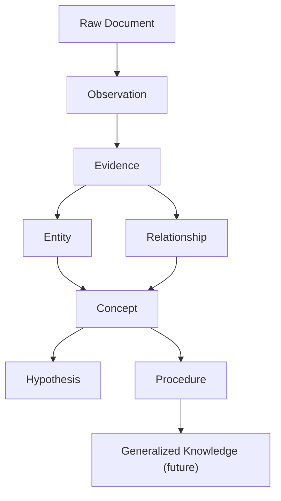

# DELTA ARC II Knowledge Substrate Architecture

ARC II defines reviewable semantic structures that future reasoning and learning
can operate upon.

ARC II stops before autonomous integration. Objects are reviewable,
provenance-bearing, and rollback-capable.

