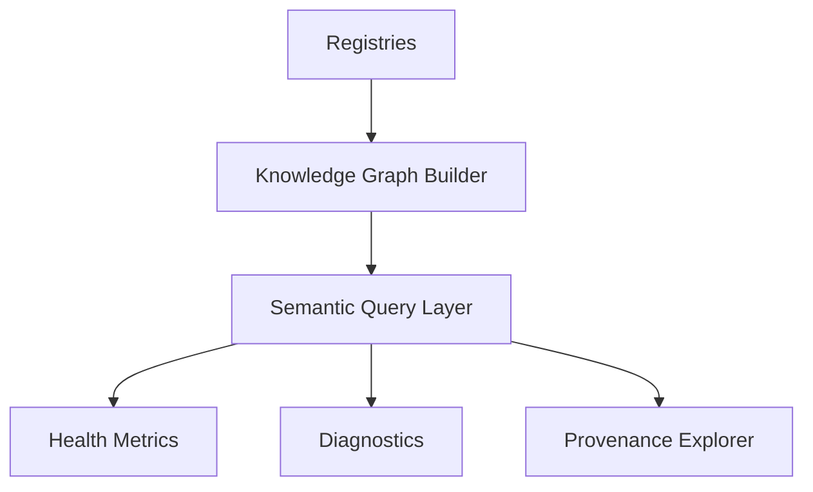

# DELTA ARC II Semantic Layer Diagram

```mermaid
flowchart TD
  A["Registries"] --> B["Knowledge Graph Builder"]
  B --> C["Semantic Query Layer"]
  C --> D["Health Metrics"]
  C --> E["Diagnostics"]
  C --> F["Provenance Explorer"]
```

The semantic layer can inspect related concepts, evidence, contradictions,
procedures, and observations. It does not perform reasoning yet.

