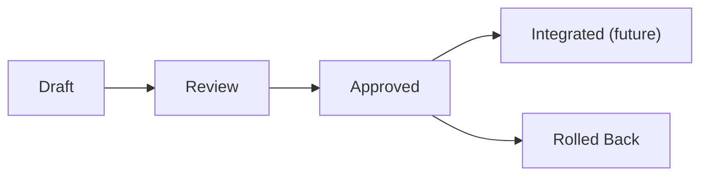

# DELTA ARC II Knowledge Transaction Lifecycle

```mermaid
flowchart LR
  A["Draft"] --> B["Review"]
  B --> C["Approved"]
  C --> D["Integrated (future)"]
  C --> E["Rolled Back"]
```

ARC II ends before `integrated`. Approval does not create a live write.

