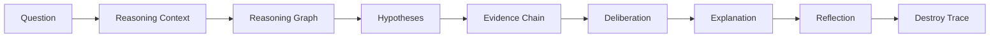

# DELTA ARC III Reasoning Architecture

ARC III introduces transient deterministic reasoning over the ARC II Knowledge
Substrate.

```mermaid
flowchart LR
  A["Question"] --> B["Reasoning Context"]
  B --> C["Reasoning Graph"]
  C --> D["Hypotheses"]
  D --> E["Evidence Chain"]
  E --> F["Deliberation"]
  F --> G["Explanation"]
  G --> H["Reflection"]
  H --> I["Destroy Trace"]
```

Reasoning is temporary. Knowledge remains durable and unchanged.

