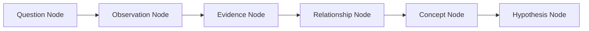

# DELTA ARC III Reasoning Graph

```mermaid
flowchart LR
  A["Question Node"] --> B["Observation Node"]
  B --> C["Evidence Node"]
  C --> D["Relationship Node"]
  D --> E["Concept Node"]
  E --> F["Hypothesis Node"]
```

Every edge carries a citation and confidence. The graph exists only for the
current request and is destroyed after completion.

