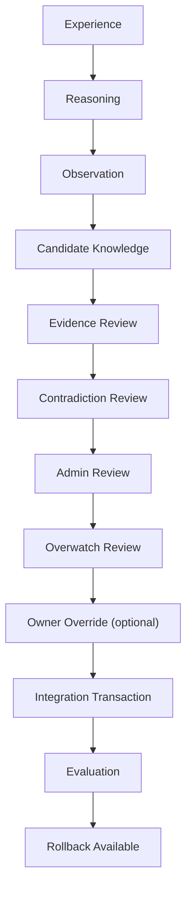

# DELTA ARC IV Knowledge Evolution Architecture

```mermaid
flowchart TD
  A["Experience"] --> B["Reasoning"]
  B --> C["Observation"]
  C --> D["Candidate Knowledge"]
  D --> E["Evidence Review"]
  E --> F["Contradiction Review"]
  F --> G["Admin Review"]
  G --> H["Overwatch Review"]
  H --> I["Owner Override (optional)"]
  I --> J["Integration Transaction"]
  J --> K["Evaluation"]
  K --> L["Rollback Available"]
```

ARC IV is simulation-only and stops at `ready_to_integrate`.

