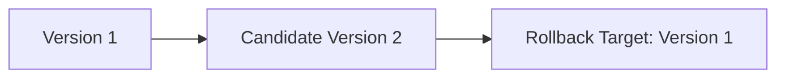

# DELTA ARC IV Knowledge Version Graph

```mermaid
flowchart LR
  A["Version 1"] --> B["Candidate Version 2"]
  B --> C["Rollback Target: Version 1"]
```

Version graphs show parents, branches, superseded nodes, and rollback targets.

