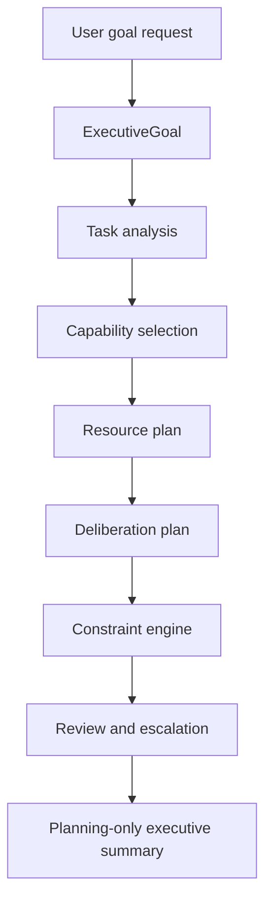

# Runtime ARC VI Executive Architecture

Runtime ARC VI introduces a planning-only executive layer above the existing
cognitive kernel and substrate scaffolds.

The executive layer coordinates goals, tasks, capabilities, resources,
constraints, review, and escalation. It does not reason directly, execute
actions, call providers, train models, mutate memory, or mutate knowledge.

The core rule is:

`executive orchestration != execution authority`

ARC VI can explain what would need to happen next, why it chose a plan, what
evidence is required, what capabilities would be used, and what blocks
execution. It cannot execute the plan.
