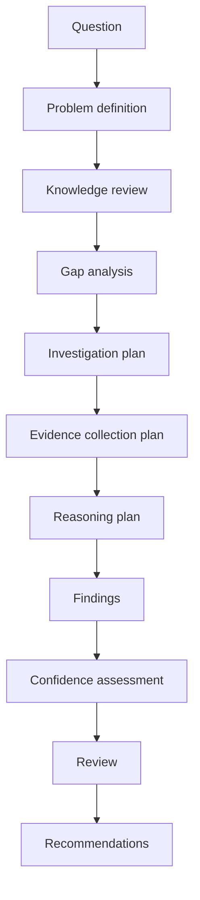

# Runtime ARC VII Investigation Workflow

ARC VII introduces structured investigation.

Flow:

Findings are separate from durable knowledge. Evidence collection is planned
only. No browsing, provider calls, knowledge mutation, or memory mutation
occurs.
