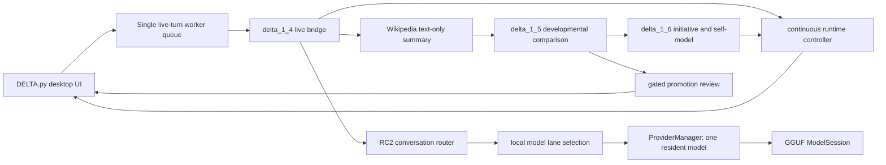

# LUNA-Style Active Runtime Map

## Role Limit

This is a LUNA-style architectural exploration performed after implementation freeze in the requested single TERRA-led cycle. It is proposal-only and not an independently switched LUNA-model review.

## Current Cognitive Flow

1. The operator sends a desktop message.
2. In live mode, the UI serializes it through one worker turn and keeps lifecycle controls responsive.
3. The live bridge first handles lifecycle, suspension, pending inquiries, gated promotion dispositions, and explicit local-model action dispositions.
4. Wikipedia requests use the only approved external surface: one text summary with provenance, throttling, caching, and bounded retry.
5. Developmental cognition compares the new text with approved local concepts and produces an observation, objective, candidate, and inquiry without writing memory.
6. Operational autonomy may surface a bounded initiative; the controller owns lifecycle, event queue, health, and auditable model residency metadata.
7. Ordinary uncertain conversation can create a one-turn local-model request. Only explicit approval enters the local GGUF lane.
8. Any promotion remains a proposal boundary. Runtime code does not persist memory, commit code, or broaden permissions.

## Strengths

- The live bridge is a real integration point rather than a report-only facade.
- Governance is expressed in both payload flags and state transitions, not only in prose.
- The local-model repair preserves a useful separation: controller records an operator-initiated event but does not autonomously decide to infer.
- The one-resident-model manager matches the hardware constraint and the real pilot demonstrated switch/unload behavior.
- The UI now makes the real async boundary visible to the operator.

## Weakest Integration Points

- `DELTA.py` still owns both broad legacy UI behavior and the new live-turn coordinator.
- `delta_1_4_live_wikipedia_runtime.py` combines transport, conversation control, approvals, model gating, developmental integration, controller synchronization, and response rendering.
- `rc2_conversational_mode_router.py` is a large phrase-rich router with both legacy behavior and active model-lane responsibilities.
- Pending promotion actions and pending local-model actions use separate dict-like representations rather than a shared typed action envelope.
- The campaign is strong on deterministic state but weak on model-aware behavioral mutation and long-horizon operator evidence.
